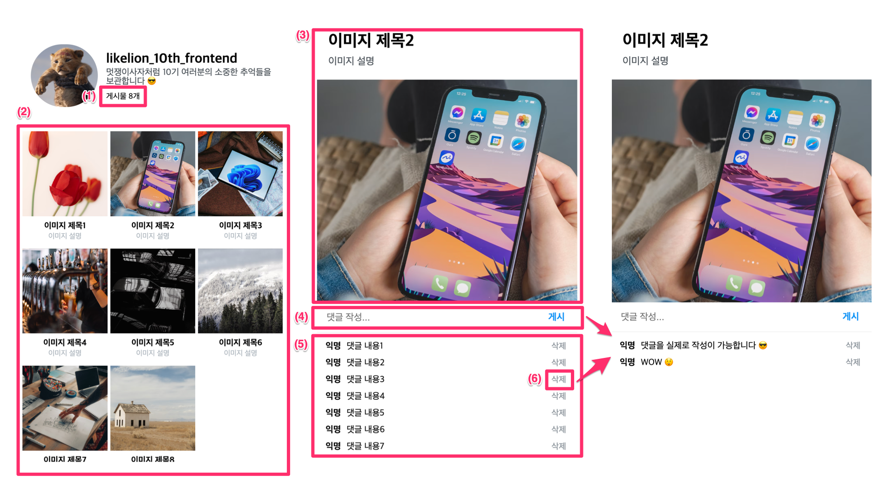

# 프론트엔드 갤러리 앱 프로젝트

## 무엇을 만드나요?

### 기능

지금까지 배운 모든 개념을 활용하여 인스타그램st의 간단한 갤러리 앱을 만듭니다.

1. REST API를 사용하여 여러가지 이미지를 불러와 사용자에게 표시합니다.
2. 이미지를 클릭하면, REST API를 사용하여 해당 이미지에 달린 댓글 목록을 불러와 사용자에게 표시합니다.
3. REST API를 사용하여 댓글을 새로 작성할 수 있습니다.
4. REST API를 사용하여 댓글을 삭제할 수 있습니다.

> REST API 가 뭔가요? => https://hudi.blog/rest-api/

### 필수 구현 사항

1. 전체 이미지의 개수를 출력합니다.
2. 여러 이미지들을 Grid 형태로 이미지, 제목, 설명을 함께 표시합니다.
3. 여러 이미지 중 하나를 클릭하면 상세한 이미지 정보와 댓글 목록을 확인할 수 있는 페이지 (2번째 사진)로 이동합니다.
4. 댓글을 작성할 수 있습니다.
5. 댓글 목록을 표시합니다.
6. 삭제 버튼을 클릭하면 해당 댓글을 삭제하고, 댓글 목록을 다시 불러옵니다.

기타 디자인과 레이아웃은 원본과 요구사항과 크게 다르지 않은 범위에서 원하는대로 만드셔도 좋습니다.

### 완성본

https://likelion-inha-10.github.io/fe-gallery-project-example

## 주요 목표

- 실제 동작하는 간단한 웹 어플리케이션을 개발할 수 있다.
- REST API 가 무엇인지 이해하며, 활용할 수 있다.

## 사용하는 주요 라이브러리

- React Router ([react-router-dom@6](https://reactrouter.com/docs/en/v6/getting-started/installation))
- Styled Components ([styled-components](https://styled-components.com/docs/basics#installation))
- Axios ([axios](https://axios-http.com/kr/docs/intro))

## 예제

- https://github.com/Likelion-Inha-10/fe-gallery-project-example

> 예제 코드는 과제 중 자유롭게 참고 가능하지만, 최대한 본인의 힘으로 해결하려 노력합시다 😇
